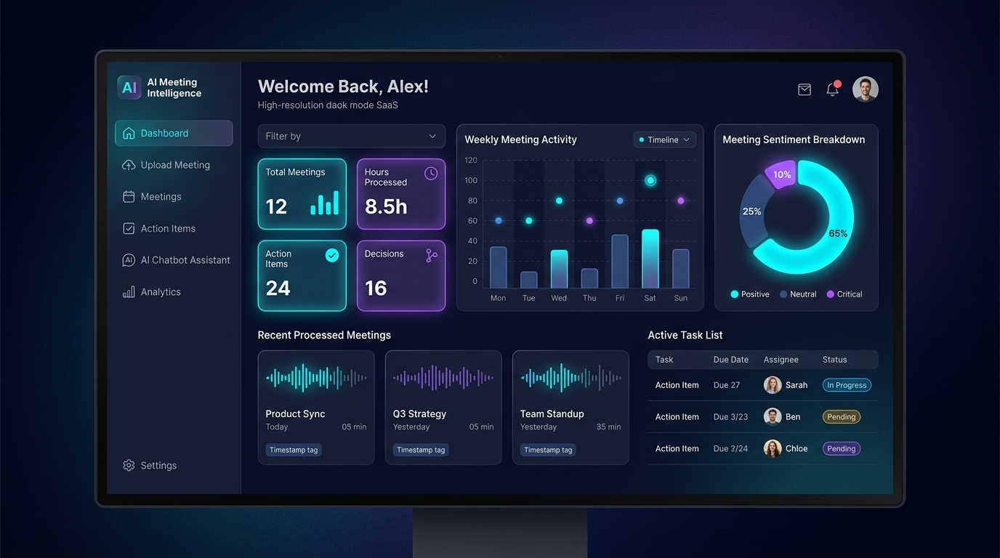
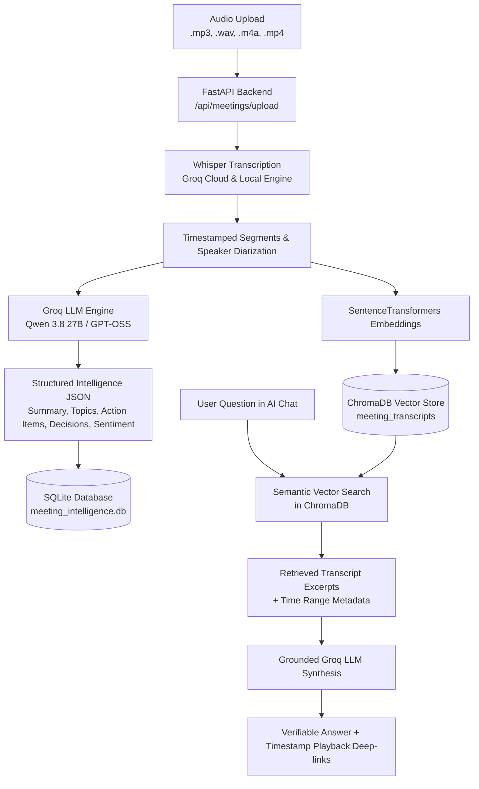

# AI Meeting Intelligence 🎙️🧠

<p align="center">
  
</p>

<p align="center">
  <strong>Transform raw audio recordings into searchable transcripts, executive summaries, actionable deliverables, and an interactive RAG conversational assistant.</strong>
</p>

<p align="center">
  
  
  
  
  
  
</p>

---

## 🌟 Overview

**AI Meeting Intelligence** is a production-grade, full-stack AI SaaS application that automates the entire post-meeting workflow:
1. **Transcribes multi-format audio/video** (MP3, WAV, M4A, MP4) with dual-engine Whisper support (Local OpenAI Whisper + ultra-fast Groq Cloud Whisper).
2. **Extracts structured meeting intelligence** using Groq LLMs (Qwen 3.8 27B / GPT-OSS 120B) — including executive summaries, categorized discussion topics, action items with assignees & deadlines, and team sentiment analysis.
3. **Indexes timestamped transcripts into ChromaDB vector store** using SentenceTransformers for semantic retrieval.
4. **Interactive RAG Chatbot** grounded in your meeting transcripts with verifiable source citations and direct timestamp deep-links.
5. **Interactive Audio Playback** with real-time waveform sync and click-to-seek transcript jumps.

---

## 🏗️ Architecture Overview



---

## ✨ Key Features

- **🎙️ Universal Audio Support**: Upload MP3, WAV, M4A, MP4, OGG, or WEBM. Zero-dependency audio decoding using bundled `imageio-ffmpeg`.
- **⚡ Dual Whisper Engine**: Choose between ultra-low-latency Groq Cloud Whisper (`whisper-large-v3-turbo`) or fully offline local OpenAI Whisper models.
- **📋 Action Items & Deliverable Tracker**: Automatically identifies action items, owners, and due dates. Includes an interactive Kanban-style completion board.
- **💡 Strategic Decisions Log**: Categorizes team decisions (Architecture, Product, Strategy, Timeline) to prevent consensus drift.
- **💬 ChromaDB RAG Assistant**: Multi-meeting semantic search assistant that answers queries with exact timestamp citations.
- **🎵 Click-to-Seek Audio Sync**: Embedded audio player with playback speed controls (1x, 1.25x, 1.5x, 2x). Clicking any transcript segment immediately jumps the audio to that exact moment.
- **📊 Interactive Analytics**: Recharts visualizations for meeting frequency, sentiment breakdown, and trending discussion topics.
- **🎨 Glassmorphic Dark/Light Mode UI**: Built with React, Tailwind CSS, Lucide icons, and micro-animations.

---

## 🛠️ Tech Stack

| Component | Technology | Description |
|---|---|---|
| **Frontend** | React 18, Vite 6, Tailwind CSS | High-performance SPA with modern dark/light mode UI |
| **Icons & Visuals** | Lucide React, Recharts, Canvas Confetti | Rich interactive charts and responsive UI components |
| **Backend API** | FastAPI, Uvicorn, Python 3.10+ | Asynchronous RESTful API backend |
| **Database** | SQLAlchemy 2.0, SQLite | Lightweight local relational persistence |
| **Vector Database** | ChromaDB Persistent Client | Local vector database for multi-meeting semantic embeddings |
| **Embeddings** | SentenceTransformers (`all-MiniLM-L6-v2`) | Local dense text embeddings for RAG retrieval |
| **Speech-to-Text** | OpenAI Whisper / Groq Whisper API | High-accuracy speech transcription with timestamps |
| **LLM Inference** | Groq Cloud SDK (`qwen/qwen3.8-27b`, `openai/gpt-oss-120b`) | Ultra-fast structured intelligence extraction & RAG answering |

---

## 📁 Repository Structure

```
AI-Meeting-Intelligence/
├── assets/
│   └── dashboard.png             # UI preview screenshot
├── backend/
│   ├── config.py                 # Pydantic configuration & environment settings
│   ├── database.py               # SQLAlchemy database session & engine
│   ├── main.py                   # FastAPI app entrypoint & CORS middleware
│   ├── models/                   # SQLAlchemy relational data models
│   │   ├── meeting.py            # Meeting metadata table
│   │   ├── transcript.py         # Timestamped transcript segments
│   │   ├── action_item.py        # Action items & completion state
│   │   └── decision.py           # Categorized meeting decisions
│   ├── routers/                  # Modular API endpoints
│   │   ├── meetings.py           # Upload, list, details, delete
│   │   ├── action_items.py       # Task deliverables & status updates
│   │   ├── chat.py               # Vector RAG Q&A assistant
│   │   ├── analytics.py          # Dashboard aggregation metrics
│   │   └── settings.py           # API configuration & demo seeder
│   ├── services/                 # Core AI & processing services
│   │   ├── whisper_service.py    # Local & Groq Whisper transcription
│   │   ├── llm_service.py        # Groq structured intelligence extractor
│   │   ├── embedding_service.py  # Vector embedding factory
│   │   └── rag_service.py        # ChromaDB indexer & grounded RAG
│   └── utils/
│       └── demo_seeder.py        # Realistic demo dataset generator
├── frontend/
│   ├── src/
│   │   ├── components/           # Navbar, Sidebar, AudioPlayer, StatCard, etc.
│   │   ├── pages/                # Dashboard, Upload, Meetings, Details, Chat, Analytics
│   │   ├── context/              # ThemeContext (Dark/Light mode)
│   │   ├── services/api.js       # Axios HTTP client
│   │   └── utils/formatters.js   # Time formatting & badge helpers
│   ├── package.json
│   └── vite.config.js
├── .env.example                  # Environment configuration template
├── .gitignore                    # Git ignore file for secrets & build files
├── README.md                     # Project documentation
├── requirements.txt              # Python dependencies
├── test_backend.py               # Backend unit test suite
└── test_e2e.py                   # End-to-end integration test suite
```

---

## 🚀 Quick Start & Installation

### Prerequisites
- **Python 3.10+**
- **Node.js 18+** & npm
- A free **[Groq Cloud API Key](https://console.groq.com/)**

### 1. Clone the Repository

```bash
git clone https://github.com/abhilasha0412/AI-Meeting-Intelligence.git
cd AI-Meeting-Intelligence
```

### 2. Backend Setup

```bash
# Create and activate a Python virtual environment
# Windows:
python -m venv .venv
.\.venv\Scripts\activate

# Linux/macOS:
python3 -m venv .venv
source .venv/bin/activate

# Install dependencies
pip install -r requirements.txt

# Configure environment variables
copy .env.example .env     # On Linux/macOS use: cp .env.example .env
```

Open `.env` and set your Groq API key:
```ini
GROQ_API_KEY=gsk_your_groq_api_key_here
GROQ_MODEL=qwen/qwen3.8-27b
USE_GROQ_WHISPER=true
```

Start the FastAPI backend server:
```bash
python -m uvicorn backend.main:app --host 127.0.0.1 --port 8000 --reload
```
API Documentation will be available at `http://127.0.0.1:8000/docs`.

### 3. Frontend Setup

In a separate terminal window:
```bash
cd frontend

# Install Node dependencies
npm install

# Start Vite development server
npm run dev
```

Open your browser at **`http://localhost:3000`**.

---

## 🧪 Testing & Verification

Run the automated backend test suite:
```bash
python test_backend.py
```

Run end-to-end processing pipeline tests:
```bash
python test_e2e.py
```

---

## 🛡️ Privacy & Security
- API keys and database credentials are kept strictly local via `.env` and are excluded from Git tracking.
- Audio files and generated vector embeddings are stored locally in `./uploads` and `./chroma_db`.

---

## 📄 License
This project is licensed under the **MIT License**.
